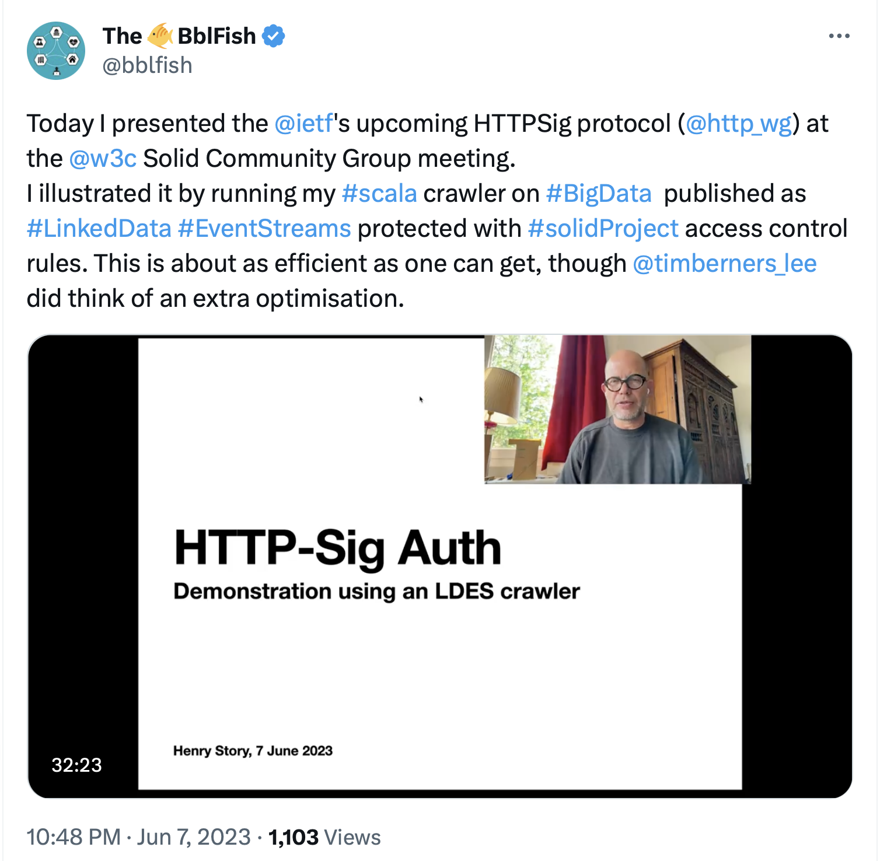

## SoLiD implementation in akka

Initial [SoLiD](https://github.com/solid/solid-spec) implementation with [akka](http://akka.io/).
This is a re-write of [rww-play](https://github.com/read-write-web/rww-play).

Reactive Solid is developed as part of the [Solid-Control](https://nlnet.nl/project/SolidControl/) project, which was funded by the the [Next Generation Internet (NGI0)](https://nlnet.nl/NGI0/) in their [Privacy and Trust Enhancing Technologies (PET)](https://nlnet.nl/PET/) call.

### Run

[](https://www.travis-ci.com/co-operating-systems/Reactive-SoLiD)

After downloading this repository you can start the server as follows:

```
$ sbt
> compile
> run test 
```

This will read and write files to the [test](test/) directory. 
(see the [test/README.0.md](test/README.0.md) for more details on how the files are organized).
Then on the command line you can try downloading a resource with

```bash
$ curl -i http://localhost:8080/hello
```

or you can upload a file with 

```bash
curl --data-binary @README.md -H "Content-Type: text/markdown" -H "Slug: README.md" -X POST http://localhost:8080/
```

### Demos

A demo that shows how to start the server and describes the [HttpSig](https://github.com/bblfish/httpSig) protocol used for the 
access control functions can be seen here: 
[](https://twitter.com/bblfish/status/1666547828506742788)
